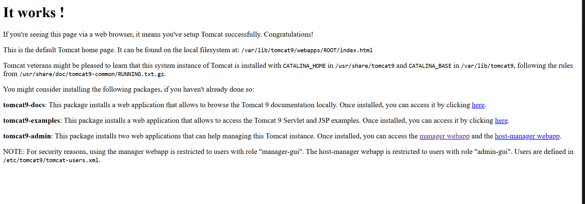
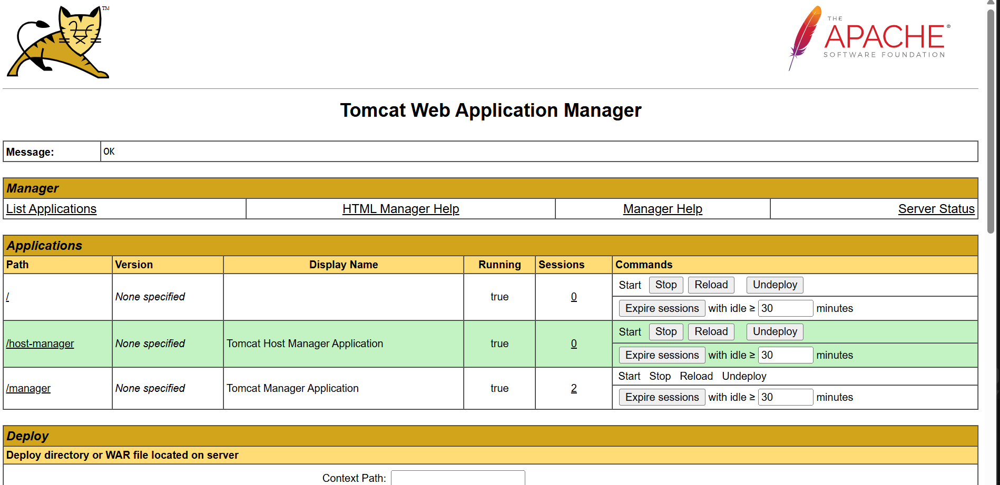
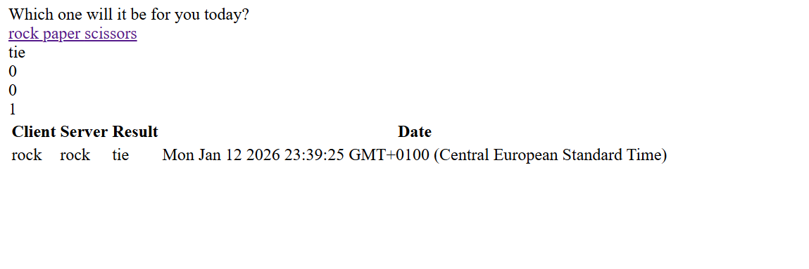

# Tomcat 9 and Maven Deployment with Vagrant & Docker

**Author:** Mario Acosta Vargas

**Date:** January 2026
**Version:** 2.0.3

**Technology Stack:** Vagrant · Debian Bullseye · Tomcat 9 · Maven · OpenJDK 11 · Docker

This project provides an automated deployment of a fully configured **Tomcat 9 application server** with **Maven deployment support** inside a Debian Bullseye virtual machine using **Vagrant** and **VirtualBox**.

The environment is provisioned through a single automated script (`bootstrap.sh`), which ensures consistent, repeatable, and reliable configuration across all deployments.

## Overview

The virtual machine includes:

- **Tomcat 9 Application Server** configured with:

  - Web-based Manager GUI for manual deployments

  - Host Manager for virtual host administration

  - Remote access enabled from any IP address

- **Maven integration** for automated WAR deployments using `tomcat7-maven-plugin`

- **Predefined users** for GUI access and Maven deployments:

  - `alumno`: Full GUI access (admin, manager interfaces)

  - `deploy`: Script-only access for Maven deployments

- **Rock-Paper-Scissors** sample application pre-configured for deployment

- **Non-interactive provisioning**, ensuring full reproducibility and no manual intervention.

This documentation describes the system architecture, deployment steps, and validation procedures.

---

# 1. Requirements

Install the following tools on your host machine:

- **Vagrant** → https://www.vagrantup.com/downloads

- **VirtualBox** → https://www.virtualbox.org/wiki/Downloads

- **Git** (optional) → https://git-scm.com/downloads

---

# 2. Project Structure

```
project-folder/
│
├── Vagrantfile              # VM configuration
├── config/
│   ├── assets/              # Screenshots for documentation
│   ├── bootstrap.sh         # Provisioning script
│   ├── tomcat-users.xml     # Tomcat users and roles
│   ├── context.xml          # Remote access configuration
│   └── tomcat1.war          # Sample WAR for manual deployment
├── readme.md
├── LICENSE
└── .gitignore
```

---

# 3. Server Configuration Summary

| Setting            | Value               | Description             |
| ------------------ | ------------------- | ----------------------- |
| **VM Box**         | `debian/bullseye64` | Operating system        |
| **Hostname**       | `tomcat.local`      | Server hostname         |
| **IP Address**     | `192.168.56.110`    | Static private IP       |
| **Forwarded Port** | `8080 → 8080`       | Tomcat web access       |
| **Memory**         | `2048 MB`           | RAM allocation          |
| **CPUs**           | `2`                 | Processor cores         |
| **GUI User**       | `alumno / 1234`     | Web interface access    |
| **Deploy User**    | `deploy / 1234`     | Maven deployment access |

This configuration is fully automated through the `bootstrap.sh` script.

---

# 4. Deploy the Server

### Step 1 — Start the virtual machine

```bash
vagrant up
```

### Step 2 — Access the machine

```bash
vagrant ssh
```

---

# 5. Verify Tomcat Server

### 5.1 - Check service status

```bash
sudo systemctl status tomcat9
```

---

### 5.2 - Access Tomcat Home Page

From your host machine browser:

```
http://localhost:8080
```



---

### 5.3 - Access Manager GUI

```
http://localhost:8080/manager/html
```

**Credentials:** `alumno` / `1234`



---

### 5.4 - Access Host Manager

```
http://localhost:8080/host-manager/html
```

**Credentials:** `alumno` / `1234`

---

# 6. Manual WAR Deployment

### 6.1 - Deploy tomcat1.war using Manager GUI

1. Access Manager GUI at `http://localhost:8080/manager/html`

2. Scroll to **"WAR file to deploy"** section

3. Click **"Browse"** and select `tomcat1.war`

4. Click **"Deploy"**

### 6.2 - Verify deployment

The application should appear in the applications list as `/tomcat1`

Access it at: `http://localhost:8080/tomcat1`

---

# 7. Maven Deployment

### 7.1 - Check Maven installation

```bash
mvn --version
```

### 7.2 - Deploy Rock-Paper-Scissors application

```bash
cd /home/vagrant/rock-paper-scissors
mvn tomcat7:deploy
```

Expected output:

```
[INFO] Deploying war to http://localhost:8080/rps
Uploaded: http://localhost:8080/manager/text/deploy?path=%2Frps (11 KB at 571.3 KB/sec)
[INFO] OK - Deployed application at context path [/rps]
[INFO] BUILD SUCCESS
```

### 7.3 - Verify deployment

Access the application at: `http://localhost:8080/rps`



### 7.4 - Other Maven commands

| Command                | Description          |
| ---------------------- | -------------------- |
| `mvn tomcat7:deploy`   | Deploy application   |
| `mvn tomcat7:redeploy` | Redeploy application |
| `mvn tomcat7:undeploy` | Remove application   |

---

# 8. How Everything Works

### Tomcat 9 Configuration

The server is configured with:

- `tomcat-users.xml` → User accounts and role assignments

- `context.xml` → Remote access configuration (allows any IP)

- Manager apps installed via `tomcat9-admin` package

### Maven Configuration

Maven is configured with:

- `/etc/maven/settings.xml` → Server credentials for Tomcat

- `pom.xml` → Tomcat7 Maven plugin configuration

The `tomcat7-maven-plugin` works with Tomcat 9 despite its name.

---

# 9. Troubleshooting

### Tomcat not starting?

```bash
sudo journalctl -u tomcat9
sudo systemctl restart tomcat9
```

### Cannot access Manager GUI?

- Verify credentials: `alumno` / `1234`

- Check `context.xml` is properly copied to both manager directories

- Restart Tomcat after config changes

### Maven deployment fails?

- Verify `deploy` user exists in `tomcat-users.xml`

- Check Maven settings: `cat /etc/maven/settings.xml`

- Ensure Tomcat is running: `sudo systemctl status tomcat9`

---

# 10. Reapply Provisioning

If you edit files in the project:

```bash
vagrant provision
```

If you edit inside the VM:

```bash
sudo systemctl restart tomcat9
```

---

# 11. Useful URLs

| URL                                       | Description                 |
| ----------------------------------------- | --------------------------- |
| `http://localhost:8080`                   | Tomcat Home                 |
| `http://localhost:8080/manager/html`      | Manager GUI                 |
| `http://localhost:8080/host-manager/html` | Host Manager                |
| `http://localhost:8080/tomcat1`           | Manual WAR deployment       |
| `http://localhost:8080/rps`               | Rock-Paper-Scissors (Maven) |

---

# 12. Extra: Docker Deployment

This project also includes a containerized deployment option using Docker.

### 12.1 - Build Approaches

1. **Single-Stage**: Deploys the existing `config/tomcat1.war`.
2. **Multi-Stage**: Simulates a build process and deploys `config/tomcat1.war`.

### 12.2 - How to Run

All commands must be run from the project root (`tarea-mav/`).

```bash
# Single-stage
docker build -t app-singlestage -f docker/Dockerfile.singlestage .
docker run -d -p 8082:8080 app-singlestage

# Multi-stage
docker build -t app-multistage -f docker/Dockerfile.multistage .
docker run -d -p 8081:8080 app-multistage
```

### 12.3 - CI/CD Pipelines

The project includes GitHub Actions workflows that generate documentation-style summaries:

- **Package**: Builds Docker images.
- **Integration Tests**: verifying the deployment using `curl` and outputs a summary table.
